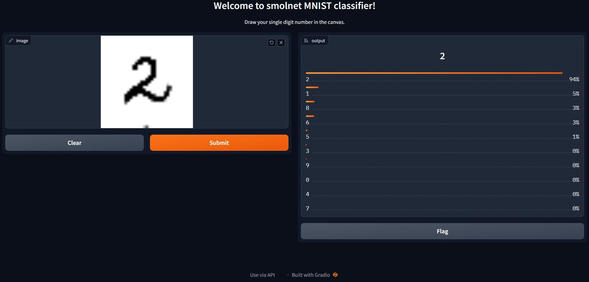

Implementation of Multi Layer Perceptron from scratch using only `numpy`. Broadly based on [Michael Nielson's book](http://neuralnetworksanddeeplearning.com/) and inspired by Karpathy's [micrograd](https://github.com/karpathy/micrograd).

To train the model with MNIST dataset and run the app, do - 
```bash
pip install -r requirements.txt
python train_smolnet.py
python app.py
```


